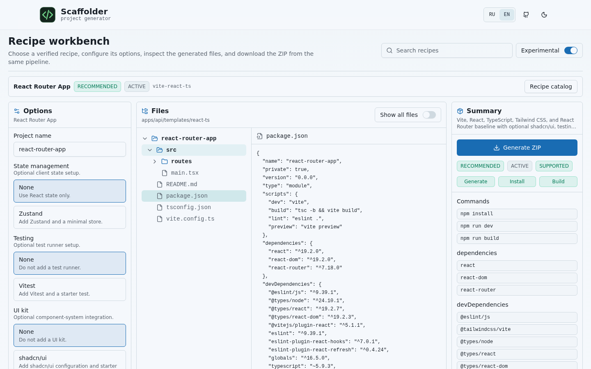

# Scaffolder

Scaffolder is an open-source frontend Initializr. It generates real project
archives from curated, verified recipes instead of asking developers to rebuild
the same Vite, React, Tailwind CSS, shadcn/ui, routing, testing, and project
structure setup by hand.

The MVP focuses on one clear pain: starting a React project that already has
the boring integration work done. Choose a recipe, configure only the options
that recipe supports, inspect the real generated files, and download a ZIP.



## Project policies

- [License](LICENSE)
- [Changelog](CHANGELOG.md)
- [Current release notes](RELEASE_NOTES.md)
- [Contributing guide](CONTRIBUTING.md)
- [Security policy](SECURITY.md)
- [Support policy](SUPPORT.md)
- [Supported combinations](SUPPORTED_COMBINATIONS.md)
- [Template compatibility policy](TEMPLATE_COMPATIBILITY.md)
- [Versioning and migration policy](VERSIONING.md)
- [Architecture note](docs/architecture.md)
- [Templates repository setup](docs/templates-repository.md)

## Product direction

Scaffolder is a recipe catalog:

- **Recipes** describe useful starting points such as a React Router app or a
  Vite React app.
- **Blocks** provide reusable integrations or starter structure, for example
  Tailwind CSS, React Router, shadcn/ui, Vitest, Zustand, or an app shell.
- **Pinned base templates** come from official upstream sources and are stored
  locally so generation stays deterministic.
- **Verification** proves that recommended recipes can be generated, installed,
  and built before they are promoted.
- **Custom dependencies** are allowed as package.json-only extras, but they are
  outside the verified recipe guarantee.

Read the recipe design documents:

- [Recipes](docs/recipes.md)
- [Recipe authoring](docs/recipe-authoring.md)
- [Recipe review](docs/recipe-review.md)
- [Recipe verification](docs/recipe-verification.md)
- [Template updates](docs/template-updates.md)

## Feedback wanted

This project is ready for technical review, not broad promotion. Useful
feedback is:

- whether the recipe format is strict enough for community contributions;
- whether `react-router-app` produces a project a developer would keep;
- whether the preview shows the right files before ZIP generation;
- which recipe request should come next and why.

Open a recipe request or technical feedback issue using the GitHub issue
templates. The open-source core does not add telemetry; promotion decisions are
based on verification, review, and maintainer judgment.

Verify recipe manifests and generated projects:

```bash
pnpm verify:recipes
```

Verify pinned promoted template snapshots:

```bash
pnpm verify:templates
```

For fast manifest-only feedback while authoring:

```bash
pnpm verify:recipes:manifests
```

## Current features

- Recipe catalog with Recommended and Community tabs, experimental badges, and
  verification metadata.
- Recipe workspace with options, custom dependency inputs, a clickable file
  explorer, curated/all files mode, file viewer, summary, and ZIP generation.
- Backend-owned presets for stable React, Vue, and Next.js profiles.
- Backend-driven support states: `supported`, `experimental`, and
  `unavailable`.
- npm registry package search.
- Separate `dependencies` and `devDependencies` additions.
- Detailed preview for the generated tree, `package.json`, README, entry
  files, dependencies, commands, support status, and verification flags.
- ZIP archive generation.

## Quick start

Install JavaScript dependencies and fetch Cargo dependencies from the repository
root:

```bash
pnpm bootstrap
```

If the repository was cloned without submodules, initialize templates:

```bash
git submodule update --init --recursive
```

Without `apps/api/templates`, the backend readiness check fails and preview or
generation endpoints are unavailable.

Run only the backend:

```bash
pnpm dev:api
```

Run only the frontend:

```bash
pnpm dev:web
```

Run both services:

```bash
pnpm dev
```

Open:

```text
http://localhost:3000
```

## Current usage

The primary UI is the recipe workbench:

1. Choose `React Router App` from the Recommended catalog.
2. Enter a project name, for example `my-react-app`.
3. Configure recipe options such as UI, testing, or state management.
4. Add custom dependencies only when you need package.json extras.
5. Inspect `package.json`, `README.md`, route files, and config files in the
   file tree.
6. Generate the project ZIP.

Preview and ZIP generation use the same recipe engine, so the workbench shows
the actual files that will be archived.

## API contract

Stable current endpoints:

- `GET /recipes` - recipe catalog metadata.
- `GET /recipes/{id}` - recipe manifest details.
- `POST /recipes/{id}/preview` - real materialized recipe project preview.
- `POST /recipes/{id}/generate` - recipe ZIP generation.
- `GET /presets` - backend-owned preset definitions.
- `GET /verification-matrix` - stable generation/install/build matrix.
- `POST /preview/details` - deterministic tree, key files, dependencies,
  commands, support status, and verification flags.
- `POST /preview` - backward-compatible file-tree preview.
- `POST /generate` - ZIP generation.
- `GET /features` - feature metadata with support status.
- `GET /capabilities`, `/ready`, `/live`, `/metrics` - runtime status.

Installer or package-manager selection is not part of the API.

More detail:

- [Presets](docs/presets.md)
- [Verification matrix](docs/verification-matrix.md)
- [CLI design](docs/cli.md)
- [Recipe model](docs/recipes.md)

Recipe endpoint errors return JSON with `code`, `message`, and `details` so
frontend clients can distinguish invalid recipe ids, invalid option values,
custom dependency errors, incompatible block selections, missing templates, and
generation failures.

## Updating preset dependencies

Feature dependencies are stored in:

```text
apps/api/api/dependency-presets.json
```

Update versions within the current major range:

```bash
npm run deps:update-presets
```

The script intentionally avoids switching presets to a new major version
because that may break template compatibility.

## Load testing

Before running a load test, the backend must be available at
`http://127.0.0.1:8000`.

Check ZIP generation:

```bash
npm run load:test:generate
```

Check preview:

```bash
npm run load:test:preview
```

Tune request count and concurrency:

```bash
LOAD_TEST_REQUESTS=100 LOAD_TEST_CONCURRENCY=10 npm run load:test:generate
```

The result is JSON with request counts, successes, failures, RPS, and latency
`min/p50/p95/max`.

Release gate thresholds:

```bash
LOAD_TEST_MAX_P95_MS=15000 LOAD_TEST_MAX_ERROR_RATE=0 npm run load:test:generate
```

## Frontend test gate

Component tests:

```bash
pnpm --filter nextjs-scaffolder test
```

E2E, accessibility audit, ZIP download, locale switch, and mobile regression
screenshots:

```bash
pnpm --filter nextjs-scaffolder test:e2e
```

Update the mobile screenshot baseline only after reviewing the visual change:

```bash
pnpm --filter nextjs-scaffolder test:e2e:update
```

## Production health and observability

Backend endpoints:

- `/live` - process liveness.
- `/ready` - readiness for Compose health checks.
- `/health` - backward-compatible health check.
- `/capabilities` - reports whether AI recommendations are configured.
- `/presets` - stable preset definitions.
- `/verification-matrix` - verified stable combinations.
- `/preview/details` - deterministic detailed preview.
- `/metrics` - Prometheus-compatible generation and error counters.

AI recommendations are optional. Set `AI_PROXY_URL` and `AI_PROXY_SECRET` in
the production environment to expose the assistant in the frontend; otherwise
the UI hides it. The recipe-first MVP keeps AI outside the core flow.

## Architecture

- `apps/web` - Next.js frontend.
- `apps/api/api` - Rust/Axum backend.
- `apps/api/templates` - project templates, currently connected as a Git
  submodule.
- `recipes` - declarative base-template, block, recipe, and file-template
  manifests.
- `apps/api/api/dependency-presets.json` - dependencies added by selected
  feature options.
- `scripts/load-test.mjs` - dependency-free load test script.
- `scripts/verify-recipes.mjs` - strict recipe and block manifest validation.
- `scripts/verify-recipe-projects.mjs` - API-backed generate/install/build
  verification.
- `scripts/template-update.mjs` - promoted template snapshot verification and
  candidate update classification.

## Before committing

The repository uses `pre-commit`. It checks YAML formatting, end-of-file
markers, trailing whitespace, conflict markers, and runs Turbo tasks for
formatting, linting, typechecking, and tests where configured.

Install dependencies and hooks once:

```bash
pnpm bootstrap
pre-commit install
```

Run all pre-commit checks:

```bash
pre-commit run --all-files
```

Run backend tests separately:

```bash
cargo test --manifest-path apps/api/api/Cargo.toml --locked
```
